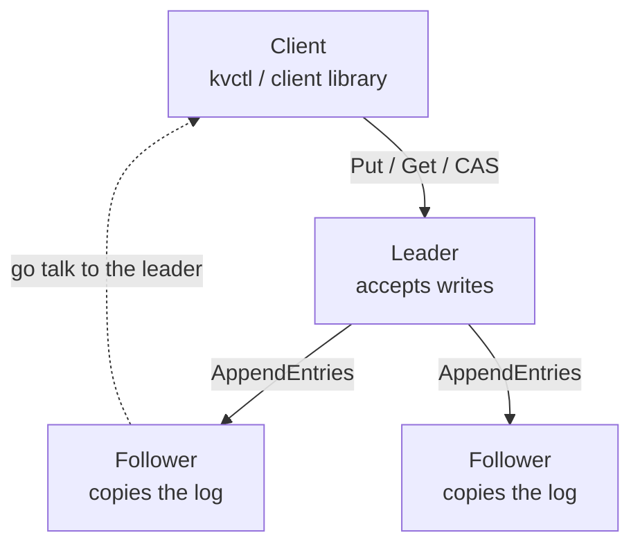
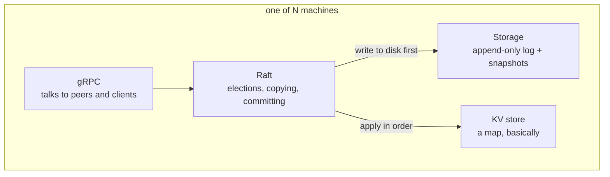

# How it works, and what it can't do

Back to the [README](README.md).

## The shape of it

One machine is the leader. Only it takes writes. When you write something, the leader copies it
to more than half the machines before it tells you the write worked. That's the whole safety
story: if a majority has it, no future leader can be elected without it.

Send a write to a follower and it doesn't just say no. It tells you the leader's address, and
the client library quietly goes there instead. So when the leader dies mid-workload, your code
sees a short pause and nothing else.

## Inside one machine

The `raft` package holds the algorithm and nothing else. It has never heard of protobuf. It
talks to the outside world through three interfaces: `Transport`, `Storage`, `StateMachine`.

That turned out to matter a lot. Because the transport is an interface, the tests can wire five
nodes straight into each other's function calls. No sockets, no ports, no processes. A five-node
cluster starts in about a millisecond, which is why the chaos tests can run hundreds of them.

## Packages

| Package | What's in it |
|---|---|
| `raft` | Elections, pre-vote, copying the log, deciding what's committed, snapshots |
| `kvstore` | The actual map. Get, Put, Delete, CAS, and duplicate detection |
| `storage` | Files that survive a hard kill |
| `transport/grpc` | Turning Raft types into protobuf and back |
| `client` | Finds the leader, follows redirects, retries |
| `internal/cluster` | Starts a real cluster in one process. Shared by the benchmark and the tests |
| `internal/linearizability` | The model the checker compares recorded histories against |
| `cmd/server`, `cmd/kvctl`, `cmd/bench` | Things you can run |

---

# Why I did it this way

**gRPC, not raw TCP.** I thought about writing my own message framing. That felt educational for
about ten minutes. Raft doesn't know gRPC exists anyway, so I could swap it later if I ever had
a reason.

**There's a fake entry at the start of the log.** Raft numbers log entries from 1. Go slices
start at 0. Rather than write `index - 1` in forty places and get one of them wrong, I put a
junk entry at position 0 so the numbers line up.

Three weeks later I added log compaction. Compaction needs a "boundary entry" that remembers the
term of the last thing you threw away. That is exactly what the junk entry already was. It
needed zero changes. I would love to tell you I planned that.

**Commands are stored as JSON.** Protobuf would be faster. I have never once been slow because
of this. And when a node is misbehaving at 2am I can open the log file and read it.

**A new leader writes an empty entry before it does anything else.** This one took me a while to
understand.

The rule (§5.4.2) is that you're not allowed to commit an entry from an old term just because
enough machines have a copy. Sensible rule. It stops some genuinely nasty bugs.

But it has a side effect. A brand new leader can inherit a write that's already sitting safely
on a majority, and be permanently banned from committing it. If nobody sends another write, that
entry just sits there forever, invisible. Your data is on disk, on most of the cluster, and
unreachable.

The fix is one empty entry in the new term. Commit that, and everything underneath it comes
along. I found this because a test failed, not because I read carefully enough.

**Reads check that the leader is still the leader.** This is the §6.4 read barrier, and it took
me a while to accept that I needed it.

The naive version of a read is "I'm the leader, here's my map". The problem is that being the
leader is not something you can know locally. A machine that got cut off from the network still
believes it's in charge, and its map can be arbitrarily out of date. So the naive version hands
you old data with total confidence, which is the worst kind of wrong.

So `Get` does this instead. Note the current commit index. Bump a counter. Wait until a
majority of machines have answered a message sent after that counter went up. Wait for the
state machine to catch up to that index. Then read.

The counter is the trick. Every message a follower answers is tagged with whatever the counter
was when the message was built, so an answer proves the follower was talking to us *after* the
read arrived. No extra messages: it rides along on the heartbeats that were happening anyway.

One thing I got wrong first time. I tried sending a dedicated round of heartbeats to confirm
the quorum. That walks straight back into a bug I'd already fixed, where two `AppendEntries` in
flight to the same follower race each other. Reusing the existing round avoids it entirely.

If you want the old behaviour, `WithStale()` on the client or `--stale` on kvctl. It's fast and
it's sometimes wrong, and now that's your decision rather than mine.

A stale read is answered by whichever machine you asked, leader or not. That's deliberate. If
you've already said you don't mind old data, there's no reason to make you queue behind the
leader for it, and it means stale reads spread across every replica instead of piling onto one
machine.

**A leader that can't reach anyone works out that it's finished.** This is CheckQuorum, and it
is the other half of the read barrier.

Being the leader is a claim, not a fact. A machine that gets cut off keeps believing it is in
charge, and nobody can correct it, because it's cut off. That's the whole problem in one
sentence.

So it watches the clock. Every reply from a follower gets timestamped. Once an election
timeout goes by without a majority answering, it stands down on its own.

It keeps the same term when it does. There is no new term. This machine just isn't the leader
any more, and inventing a term number here would only disrupt whatever the reachable side has
already sorted out for itself.

The read barrier already made a cut-off leader harmless. This makes it *quick*. Before, a read
sent to one had to wait for the caller's timeout. Now it gets told "not the leader" in about
half a second and can go find the real one.

**Pre-vote.** Before a machine starts an election, it asks around: "would you vote for me?" It
only bumps its term number if the answer is yes. And nobody says yes while they can still hear
from a healthy leader.

Without this, one machine that got disconnected for two seconds comes back with a term number
way higher than everyone else's. It refuses the real leader's messages because they look old.
Then it forces an election. Then it does it again. Forever. One sulky machine takes down the
whole cluster.

The test for this used to hang for twenty seconds before I gave up and killed it. Now it passes
in 0.3 seconds.

**Duplicate detection lives in the state machine, not the server.** Every machine replays the
same log, so they all have to agree on what counts as a duplicate. If the leader skips a retry
and the followers apply it, they've drifted apart and nothing tells you.

Also, a duplicate replays the *saved answer* rather than running again. If you retry a
compare-and-swap after a timeout, and it re-runs, it'll tell you that you lost a race you
actually won. That's not a bug you find in testing. That's a bug you find in a support ticket.

**Nothing is confirmed before it's on disk.** Term changes, votes, log entries: all flushed
before any reply that depends on them. You cannot see this working. You can only see it not
working, by killing the process at exactly the wrong moment. Which is what the crash test does,
several thousand times.

**The log only gets truncated on a real conflict.** The obvious version is one line:
`append(log[:prev+1], entries...)`. It reads beautifully. It also deletes committed entries the
first time a delayed message shows up late. So instead it only cuts where the terms genuinely
disagree.

**One message in flight per follower at a time.** This isn't really a decision. It's something I
broke and had to put back. The heartbeat timer had been enforcing it by accident, and when I
made replication faster I removed it without noticing.

It turned out to be worth 70% more throughput as well as fixing the safety bug, which was not
what I expected. The story is in [BENCHMARKS.md](BENCHMARKS.md).

---

# What it can't do

I'd rather say this plainly than have you find out.

**Snapshots aren't chunked.** They go in one gRPC message. gRPC's default limit is 4MB, so a
state machine bigger than that simply won't transfer. The paper explains how to chunk it. I
didn't.

**Client sessions leak.** I keep one duplicate-detection record per client, forever, and copy
them all into every snapshot. Real systems expire these. Mine doesn't, which is a polite way of
saying I skipped it.

**Every write flushes to disk on its own.** Batching several writes into one flush is the
obvious next speedup, and the benchmark says it's worth a lot.

**You can't change the cluster membership.** The machine list is fixed at startup. Adding and
removing nodes safely is §6 of the paper and it isn't here.

**I've never run the race detector.** It needs a C compiler and there isn't one on this laptop.
Five of my six bugs were mutex mistakes. So the race detector is far and away the most useful
thing missing from this repo, and yes, I do see the irony.
