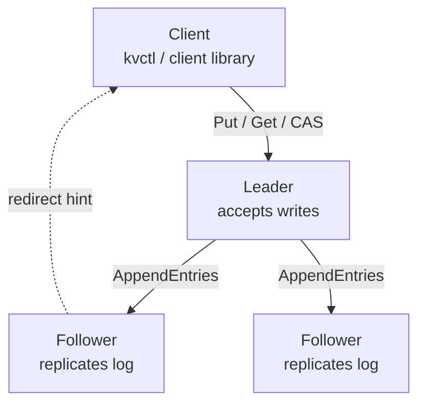
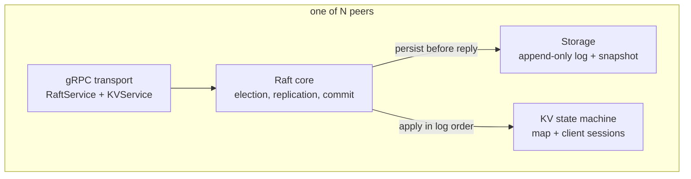

# How it's built, and what it can't do

Back to the [README](README.md).

## Cluster

Only the leader accepts writes. Every write is replicated to a majority before the client is
told it succeeded. A follower that receives a write replies with a `LeaderRedirect` carrying
the current leader's address, and the client library follows it transparently, so killing the
leader mid-workload is invisible to the caller beyond a brief pause.

## Inside a node

The Raft core owns the algorithm and its own domain types. It never imports protobuf. Three
interfaces (`Transport`, `Storage`, `StateMachine`) are the only ways out, which is what makes
the in-memory test cluster possible: five nodes wired straight into each other's handlers, no
sockets, no processes.

## Packages

| Package | What lives there |
|---|---|
| `raft` | Elections, pre-vote, replication, the commit rule, snapshots, apply loop |
| `kvstore` | The map, Get/Put/Delete/CAS, request dedup |
| `storage` | Append-only log and snapshot files that survive a hard kill |
| `transport/grpc` | Protobuf translation, both gRPC services |
| `client` | Leader discovery, redirects, retries, idempotency |
| `internal/cluster` | Starts a real N-node cluster in one process, shared by the benchmark and the integration tests |
| `cmd/server`, `cmd/kvctl`, `cmd/bench` | Entrypoints |

---

# Decisions, and how much thought actually went into them

**gRPC instead of raw TCP.** Writing my own framing sounded educational for about ten minutes.
`raft.Transport` keeps protobuf out of the core anyway, so the tests skip the network entirely
and I could rip gRPC out later if I ever grew a reason to.

**The log starts with a junk entry at index 0.** Raft is 1-indexed, Go slices are not, and I
did not want to write `index - 1` four hundred times. So the log carries a dummy entry at the
head and the two numbering schemes line up. Three weeks later, log compaction needed a
"boundary entry" holding the term of the last compacted index, which is precisely what that
junk entry already was. Zero changes. I would love to claim I planned this.

**Commands are JSON.** Protobuf would be faster. I have never once been bottlenecked here, and
when a node is misbehaving at 2am I can read the log entries with my eyes.

**A new leader writes an empty entry before doing anything else.** §5.4.2 says you can't commit
a previous term's entry by counting replicas. Fine, sensible, prevents a real disaster. It also
means a fresh leader can inherit a write that is sitting durably on a majority and be
permanently forbidden from committing it. No new writes arrive, `commitIndex` never moves, and
that write is just gone as far as anyone can tell. The fix is one no-op entry in the current
term, and committing it drags everything underneath along. I found this because a failover test
failed, not because I read the paper carefully enough.

**Pre-vote.** An election timeout runs a straw poll before touching any term, and voters say no
while they can still hear a leader. Without it, a node that got partitioned for two seconds
comes back with a wildly inflated term, refuses the real leader's heartbeats because they look
stale, and deposes a leader every single round. Forever. One sulking node takes the whole
cluster down with it. The test that demonstrates this used to hang for twenty seconds before I
gave up and killed it; it now passes in 0.3.

**Dedup lives in the state machine, not the RPC layer.** Every replica applies the same log, so
they'd better all agree on what counts as a duplicate. Put the check in the server and the
leader skips a retry that the followers cheerfully apply, and now your replicas disagree and
nothing tells you. Duplicates also replay the *cached result* rather than re-running, because a
retried compare-and-swap that re-executes will tell the client it lost a race it actually won.
That's not a bug, that's a support ticket.

**Nothing is acknowledged before it's on disk.** Term changes, votes, log appends: all
`fsync`ed before any reply that depends on them. Completely invisible unless you kill the
process at exactly the wrong moment, which is why the crash test kills the process at several
thousand wrong moments.

**Truncation only on a genuine term conflict.** The obvious implementation is
`append(log[:prev+1], entries...)`, one line, reads beautifully, and will happily delete
committed entries the first time a duplicate `AppendEntries` shows up late.

**One in-flight `AppendEntries` per follower.** Not a decision so much as something I broke and
had to put back. The 50ms heartbeat ticker had been quietly enforcing it; when I made
replication wake on every proposal, concurrent requests to the same follower started racing.
There is now an explicit per-peer flag. The whole story is in [BENCHMARKS.md](BENCHMARKS.md).

---

# Things it doesn't do, and I know

**Linearizable reads.** `Get` reads the leader's local map without checking it still has a
quorum. A leader that got partitioned away and hasn't noticed will happily serve you stale data
with total confidence. Writes are fine, it can't commit without a majority. The fix is a
ReadIndex barrier (§6.4). Until then the honest claim is "linearizable writes, reads that are
usually right". This is also why Porcupine isn't wired up: it would spend the entire run
reporting read anomalies I've already written down here, which is an expensive way to be told
something I know.

**CheckQuorum.** Same root cause. A partitioned leader stays leader until someone tells it
about a higher term.

**Chunked snapshots.** They go in one message. A state machine over gRPC's 4MB default simply
won't transfer. The paper chunks it. I did not.

**Session cleanup.** One dedup entry per client id, kept forever, faithfully copied into every
snapshot. Real systems expire these on a lease. This one leaks by design, which is a generous
way of saying I didn't do it.

**Batched `fsync`.** Every proposal flushes on its own. Grouping concurrent proposals into one
disk flush is the obvious next throughput win, and the numbers say it's worth roughly
everything.

**Membership changes.** Peer set is fixed at startup. Joint consensus is §6 and it is not here.

**`-race`.** Requires cgo, and there's no C compiler on this machine. Five of the six bugs in
[TESTING.md](TESTING.md) were lock discipline errors. The race detector is, without much
competition, the highest value thing missing from this repo, and I am aware of the irony.
