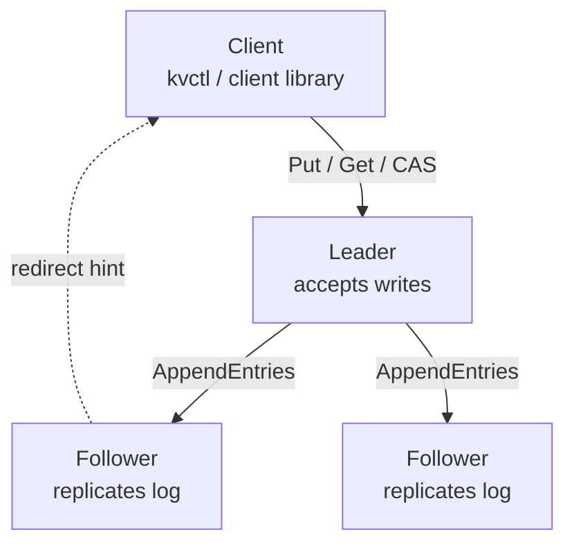
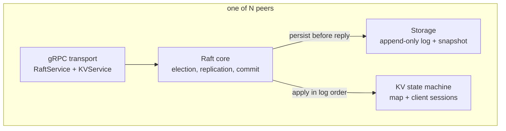

# raft-kv

A distributed key-value store built on Raft.

It works now. It also worked six separate times when it didn't, and the only reason I know
that is a test harness that spends its life partitioning the cluster and asking rude
questions. More on that below, because it's the only genuinely interesting part of this repo.

```bash
powershell -File scripts/start-cluster.ps1

go run ./cmd/kvctl --peers localhost:5001,localhost:5002,localhost:5003 put foo bar
go run ./cmd/kvctl --peers localhost:5001,localhost:5002,localhost:5003 get foo
```

Close whichever terminal is the leader. Run `get` again. The client sorts itself out.

Yes, the scripts are PowerShell. I develop on Windows. We all have our burdens. (If i could switch to linux i would trust me.) 
[I'll add the scripts for bash later]

---

## Architecture

### Cluster



Only the leader accepts writes. Every write is replicated to a majority before the client is
told it succeeded. A follower that receives a write replies with a `LeaderRedirect` carrying
the current leader's address, and the client library follows it transparently, so killing the
leader mid-workload is invisible to the caller beyond a brief pause.

### Inside a node



The Raft core owns the algorithm and its own domain types. It never imports protobuf. Three
interfaces (`Transport`, `Storage`, `StateMachine`) are the only ways out, which is what makes
the in-memory test cluster possible: five nodes wired straight into each other's handlers, no
sockets, no processes.

### Packages

| Package | What lives there |
|---|---|
| `raft` | Elections, pre-vote, replication, the commit rule, snapshots, apply loop |
| `kvstore` | The map, Get/Put/Delete/CAS, request dedup |
| `storage` | Append-only log and snapshot files that survive a hard kill |
| `transport/grpc` | Protobuf translation, both gRPC services |
| `client` | Leader discovery, redirects, retries, idempotency |
| `cmd/server`, `cmd/kvctl` | Entrypoints |

---

## Decisions, and how much thought actually went into them

**gRPC instead of raw TCP.** Writing my own framing sounded educational for about ten minutes.
`raft.Transport` keeps protobuf out of the core anyway, so the tests skip the network entirely
and I could rip gRPC out later if I ever grew a reason to.

**The log starts with a junk entry at index 0.** Raft is 1-indexed, Go slices are not, and I
did not want to write `index - 1` four hundred times. So the log carries a dummy entry at the
head and the two numbering schemes line up. Three weeks later, log compaction needed a
"boundary entry" holding the term of the last compacted index, which is precisely what that
junk entry already was. Zero changes. I would love to claim I planned this.

**Commands are JSON.** Protobuf would be faster. I have never once been bottlenecked here, and
when a node is misbehaving at 2am I can read the log entries with my eyes.

**A new leader writes an empty entry before doing anything else.** §5.4.2 says you can't commit
a previous term's entry by counting replicas. Fine, sensible, prevents a real disaster. It also
means a fresh leader can inherit a write that is sitting durably on a majority and be
permanently forbidden from committing it. No new writes arrive, `commitIndex` never moves, and
that write is just gone as far as anyone can tell. The fix is one no-op entry in the current
term, and committing it drags everything underneath along. I found this because a failover test
failed, not because I read the paper carefully enough.

**Pre-vote.** An election timeout now runs a straw poll before touching any term, and voters
say no while they can still hear a leader. Without it, a node that got partitioned for two
seconds comes back with a wildly inflated term, refuses the real leader's heartbeats because
they look stale, and deposes a leader every single round. Forever. One sulking node takes the
whole cluster down with it. The test that demonstrates this used to hang for twenty seconds
before I gave up and killed it; it now passes in 0.3.

**Dedup lives in the state machine, not the RPC layer.** Every replica applies the same log, so
they'd better all agree on what counts as a duplicate. Put the check in the server and the
leader skips a retry that the followers cheerfully apply, and now your replicas disagree and
nothing tells you. Duplicates also replay the *cached result* rather than re-running, because a
retried compare-and-swap that re-executes will tell the client it lost a race it actually won.
That's not a bug, that's a support ticket.

**Nothing is acknowledged before it's on disk.** Term changes, votes, log appends: all
`fsync`ed before any reply that depends on them. This is completely invisible unless you kill
the process at exactly the wrong moment, which is why the crash test kills the process at
several thousand wrong moments.

**Truncation only on a genuine term conflict.** The obvious implementation is
`append(log[:prev+1], entries...)`, one line, reads beautifully, and will happily delete
committed entries the first time a duplicate `AppendEntries` shows up late.

---

## Testing

```bash
go test ./...                                          # 66 tests
powershell -File scripts/crash-test.ps1                # kill -9, repeatedly
powershell -File scripts/chaos-sweep.ps1 -Seeds 20     # invariant sweep
go test ./raft/ -run TestChaos -chaos.duration=30m     # soak
```

Unit tests cover the stuff that is easy to get quietly wrong: the commit rule, truncation
versus duplicate delivery, snapshot boundary arithmetic, `uint64` subtraction that wraps to
eighteen quintillion if you look at it funny.

Above that, an in-memory transport runs actual multi-node Raft with no sockets involved. A
hundred commands converging across five nodes, a follower whose log I deliberately vandalise
repairing itself, a follower left behind long enough that it needs a whole snapshot.

`crash-test.ps1` starts real processes and `kill -9`s a random one mid-workload, restarts it,
and checks every acknowledged write is still there. Twenty cycles. Graceful shutdown testing
is a comfort blanket; it proves nothing, because the bugs live in the gap between "wrote to
the page cache" and "actually on the disk".

`TestChaos` is where the value is. Four writers hammering five nodes while a scheduler
partitions them, isolates the leader, and layers on message loss, duplication and delay. Three
invariants checked every 5ms for the entire run:

- at most one leader per term
- `commitIndex` never goes backwards
- every node's applied sequence is a prefix of every other node's

The third quietly covers "no acknowledged write ever vanished", which is the one that would
end your week.

Fifteen minutes of it:

```
writes attempted=48473  acked=45939  rejected=2534
delivered=61401  dropped=1879  duplicated=1502  partitioned=26675
invariant checks=179748  violations=0
```

A third of all attempted RPCs hit an active partition and 5% of writes were correctly refused.
If those numbers were near zero I'd have written a very expensive way of doing nothing.

---

## Numbers

Five nodes in one process, real gRPC over localhost, real `fsync` to a real SSD. Eight
concurrent writers, 15 seconds per cluster size. This is a laptop, not a datacentre, so read
the shape rather than the absolute values.

```
nodes   writers     writes/s          p50          p95          p99   failed
3       8              254.5     29.012ms      46.19ms     57.822ms        0
5       8              248.7     29.902ms     46.253ms     60.164ms        0
7       8              242.5     30.326ms      48.57ms     58.264ms        0

failover: leader death to the next successful write
nodes   trials            mean          min          max
3       1                420ms        420ms        420ms
5       2                265ms        218ms        312ms
7       3                264ms        219ms        309ms
```

```bash
go run ./cmd/bench --sizes 3,5,7 --writers 8 --duration 15s
```

**Growing the cluster costs almost nothing.** 254 to 242 writes/s going from three nodes to
seven. A majority of seven is four, the extra peers are replicated to in parallel, and the
leader waits on the fastest majority either way.

**Failover lands around 250ms**, which is just the randomised election timeout (150-300ms)
doing its job. Nothing clever, and it doesn't need to be.

**The first benchmark run was embarrassing.** 159 writes/s, identical at every cluster size,
p50 of 49.98ms. That is not a coincidence: the heartbeat interval is 50ms. Writes were being
appended to the log and then sitting there until the replication ticker happened to come
round, so every write paid an average of 25ms of pure waiting. The fix was a buffered channel
that `Propose` pokes so replication wakes immediately rather than on the tick. Ten lines, 159
to 406 writes/s.

**Then the chaos tests started failing.** Two seeds out of twelve, applied logs diverging
between nodes. I assumed I'd merely exposed something old, so I reverted the change and reran
at matched write volume: clean, three for three. I had broken it.

The 50ms ticker had been quietly enforcing something I never noticed: at most one
`AppendEntries` in flight per follower at a time. Waking replication on every proposal
removed that, and concurrent requests to the same follower started racing. The fix is a
per-peer in-flight flag, so a proposal still wakes replication instantly but a peer that is
already mid-request doesn't get a second one. Plus per-RPC timeouts, so a peer that stops
answering releases its slot instead of blocking replication to itself forever.

That costs pipelining: 406 back down to 254. Still 1.6x the ticker-bound baseline, and it
passes 19 chaos seeds including the two that reliably failed before. I would rather have 254
that is correct.

Whoever wrote that 50ms ticker did me a favour by accident, which is a slightly humbling thing
to discover about yourself.

**p50 of 29ms is mostly disk.** A write is `fsync` on the leader, then `fsync` on each
follower before it acknowledges, and the leader can't commit until a majority have done that.
Two serial disk flushes on consumer hardware is basically the whole number. Batching multiple
pending commands into one `fsync` is the obvious next win and is not implemented.

---

## Six bugs the chaos tests found, ranked by how bad I felt

Every one of these passed the full unit and integration suite at the time. Every one needs a
partition, a snapshot and an election happening simultaneously, which is exactly the scenario
you are not picturing while writing unit tests. None of them return an error. They just
corrupt data and let you carry on.

**1. `sendSnapshot` read the snapshot blob and the snapshot index in two separate lock
acquisitions.** Take a new snapshot in the gap and you ship old data labelled with a new index.
The follower installs it, sets `lastApplied` to an index whose contents it never received, and
everything in between is gone. Permanently. This is the one that made acknowledged writes
disappear, and it is the reason I stopped trusting myself around mutexes.

**2. `makeAppendEntriesRequestFor` stamped requests with the current term instead of the term
the replication loop was running for.** So a node that had already stepped down carried on
sending `AppendEntries` under a term it no longer owned, and followers dutifully truncated
their committed entries to match a node that was not the leader. Four nodes threw away a
committed entry in one run.

**3. `applyCommitted` sliced `log[start:start+n]`.** Go permits slicing past `len` as long as
you're within `cap`. After a truncation the discarded entries are still sitting in the backing
array, so this read them and applied them. No panic. No error. The node simply started living
in a slightly different universe.

**4. `advancePeerProgress` checked leadership outside the lock it then mutated under.** A reply
from a long-dead term could land after re-election and repopulate `matchIndex`, which
`becomeLeader` had just zeroed. Instant fabricated majority.

**5. `HandleInstallSnapshot` computed which log entries to keep, dropped the lock to restore
the state machine, then wrote that now-stale list back.** Anything appended during the restore
was silently erased.

**6. `maybeSnapshot` serialised the state machine without holding the apply lock.** Contents
from one index, label from another. Same joke as #1, different function.

Bug 2 got caught by an assertion that is still in the code: if a truncation would ever discard
an already-applied entry, the node prints a `SAFETY:` line. It should never print. If it does,
committed data is already gone, and I would rather find out immediately than reverse-engineer
a divergence three hours later from `applied=115` versus `applied=116`.

Five of the six are the same mistake in different costumes: drop a lock partway through an
operation, then keep using a value you read before the gap. If you take one thing from this
repo, take that.

---

## Things it doesn't do, and I know

**Linearizable reads.** `Get` reads the leader's local map without checking it still has a
quorum. A leader that got partitioned away and hasn't noticed will happily serve you stale
data with total confidence. Writes are fine, it can't commit without a majority. The fix is a
ReadIndex barrier (§6.4). Until then the honest claim is "linearizable writes, reads that are
usually right". This is also why Porcupine isn't wired up: it would spend the entire run
reporting read anomalies I've already written down here, which is an expensive way to be told
something I know.

**CheckQuorum.** Same root cause. A partitioned leader stays leader until someone tells it
about a higher term.

**Chunked snapshots.** They go in one message. A state machine over gRPC's 4MB default simply
won't transfer. The paper chunks it. I did not.

**Session cleanup.** One dedup entry per client id, kept forever, faithfully copied into every
snapshot. Real systems expire these on a lease. This one leaks by design, which is a generous
way of saying I didn't do it.

**Batched `fsync`.** Every proposal flushes on its own. Grouping concurrent proposals into one
disk flush is the obvious next throughput win and the benchmark above says it's worth roughly
everything.

**Structured logging.** It's `fmt.Printf`. All of it. It was fine at week two and it is not
fine now.

**Membership changes.** Peer set is fixed at startup. Joint consensus is §6 and it is not here.

**`-race`.** Requires cgo, and there's no C compiler on this machine. Five of the six bugs
above were lock discipline errors. The race detector is, without much competition, the highest
value thing missing from this repo, and I am aware of the irony.

---

## Running it

Go 1.26+.

```bash
go build ./...
go test ./...
```

Five nodes locally, each persisting to `data/<id>.log`:

```bash
powershell -File scripts/start-cluster.ps1
```

One node by hand:

```bash
go run ./cmd/server --id node1 --addr localhost:5001 --peers node2=localhost:5002,node3=localhost:5003 --data-dir data
```

Benchmarks:

```bash
go run ./cmd/bench --sizes 3,5,7 --writers 8 --duration 15s
```

`kvctl` does `get`, `put`, `delete`, `cas`:

```bash
go run ./cmd/kvctl --peers localhost:5001,localhost:5002,localhost:5003 cas foo bar baz
```

`get` exits non-zero on a missing key, so it composes in scripts.

---

## Reference

Ongaro & Ousterhout, *In Search of an Understandable Consensus Algorithm*. The sections I
actually kept going back to: §5.4.2 for the commit rule, §5.3 for log matching, §6.4 for
read-only queries, §9.6 for pre-vote.

The paper is genuinely well written. Most of my bugs were in the parts it doesn't cover,
which is to say the parts where I had to make my own decisions.
